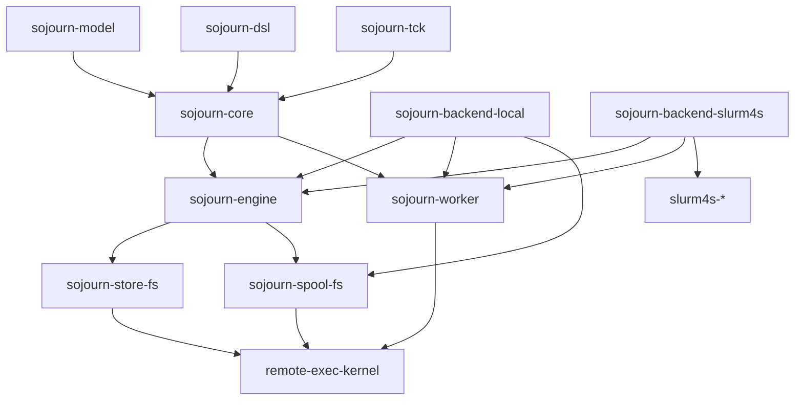

# Sojourn 1.0 contract program

**Status:** plan of record  
**Date:** 2026-08-04  
**Supersedes for 1.0 scope:** incremental feature work on the current module graph  
**Inputs:** Sojourn 1.0 review + source echeck (2026-08-04)  
**Prior plan:** [2026-07-24-remote-executor.md](2026-07-24-remote-executor.md) (historical; much already landed)

## Locked decisions

| Fork | Choice | Meaning |
| --- | --- | --- |
| Pools for 1.0 | **1C** | Capability-split `Site` / `PoolCapableSite` immediately. Implement and TCK-certify Slurm pilot pools **before** any `1.0.0` tag. Batch-only RCs are allowed; the version number is not. |
| Worker ownership | **2A** | New in-repo `sojourn-worker` owns Program runtime, invocation/result meaning, catalog/release fingerprints, and artifact bridge. Only `sojourn-backend-slurm4s` depends on slurm4s. M0 includes a short survey of slurm4s for truly neutral leftovers; promote only evidence-backed primitives into `remote-exec-kernel` (not a new sibling worker repo). |

## Product thesis (DNA to enforce as laws)

1. Tell the truth (Unknown, cancel request ≠ observation, vanished ≠ failed).
2. One logical request → one canonical `RequestFingerprint`.
3. Backends provide capabilities, not exceptions.
4. Bytes stream; values refer.
5. Every outcome carries provenance (`TaskReport`).
6. Durable things have durable descriptors (`TaskDescriptor` + `attach`).
7. Backend neutrality proved by dependency direction + TCK laws.

## Target module graph

```text
sojourn-model          pure identities, schemas, contracts, refs, outcomes, reports
sojourn-core           Site / BatchExecutor / PoolAllocator / ObjectStore capability algebras
sojourn-engine         admission, fingerprinting, task state machine, publication, attachment
sojourn-worker         Program runtime + backend-neutral invocation/result protocol
sojourn-store-fs       content-addressed filesystem store (true streaming)
sojourn-spool-fs       shared-filesystem pilot transport (not part of universal Site)
sojourn-backend-local  local fibers/processes (PoolCapableSite)
sojourn-backend-slurm4s  ONLY module depending on slurm4s
sojourn-dsl            ergonomics; no backend deps
sojourn-all            optional aggregate
sojourn-tck            capability-specific conformance
sojourn-bench          JMH + scale harness (M4+)
sojourn-demo           unpublished worker binary + acceptance ops
```

Migration from today: rename/split `sojourn-core` → model+core; extract engine/worker/store/spool from `sojourn-runtime`; rename `local`/`slurm`; peel backends out of `dsl`.



## Milestone map (every review item)

| Milestone | Review §§ | Exit criterion |
| --- | --- | --- |
| **M0** Trustworthy build | P0.1, §18 strictness start, dep graph police | Clean empty-cache CI green on published immutable deps |
| **M1** Semantic identity | §3, §4, §5, Program | One fingerprint law across local/pool/Slurm; retry language truthful |
| **M2** Capability model | P0.2, P0.3, P0.4, §15 SPI start | `Site` vs `PoolCapableSite`; DSL backend-free; worker in `sojourn-worker` |
| **M3** Correctness closure | §6–§13 races/store/spool/outcomes | No known P0 races; store/ref hardened; spool fully bound |
| **M4** Durability + data-plane scale | §7 rewrite finish, §14, §16 | `attach`; true O(chunk) streaming; sharded spool; GC/retention |
| **M5** Certification | §17 | Pure laws + expanded TCK + Slurm batch + Slurm pool + cross-node probes |
| **M6** Release quality | §18 remainder, §20–§22, §19 keep | Compat policy, docs, SBOM, MiMa baseline on RC API |

Slurm pool implementation lands across **M2 (API)** → **M3/M4 (runtime)** → **M5 (cert)** and **gates M6 / 1.0.0**.

---

## M0 — Trustworthy build

**Addresses:** P0.1; README/CI lie; stale `scala-slurm-*` coordinates; strictEquality kickoff; generated dep-graph check.

### Actions

1. **Publish compatible slurm4s release** (or use an already-published immutable version) that provides:
   - `remote-exec-kernel` (or equivalent coordinates Sojourn imports)
   - managed/local/ssh surfaces needed by the current Slurm adapter
2. In [project/Dependencies.scala](project/Dependencies.scala): replace every `scala-slurm-*` / `0.1.0-SNAPSHOT` with exact `slurm4s-*` (and kernel) versions.
3. Delete normal-path reliance on [scala-slurm.sha](scala-slurm.sha) + sibling `publishLocal` from [README.md](README.md). Keep an **optional** integration workflow that builds against sibling HEAD.
4. Fix [.github/workflows/ci.yml](.github/workflows/ci.yml): clean-cache (or empty Coursier) job must build/test without local SNAPSHOTs.
5. Add a **dependency compatibility / graph gate**:
   - `sojourn-model` / `sojourn-core` / `sojourn-dsl` / `sojourn-worker` must not depend on slurm4s
   - only `sojourn-backend-slurm4s` may
6. Enable `-language:strictEquality` and unused/value-discard/non-unit warnings (align with slurm4s). Fix fallout incrementally but gate CI on it by end of M0.
7. **Worker survey spike (≤1–2 days):** list types Sojourn still imports from `scalaslurm.worker` / protocol; classify each as (a) move to `sojourn-worker`, (b) already in `remote-exec-kernel`, (c) must stay slurm4s-only. No new sibling repo unless survey finds a large neutral surface.

### Exit

- Fresh clone + empty cache → `sbt test` green against published artifacts.
- CI matches README.
- Dep-graph check fails if scheduler artifacts leak into neutral modules.

---

## M1 — Freeze semantic identity

**Addresses:** §3, §4, §5; first-issue P0 RequestFingerprint; retry docs/laws.

### Model

Introduce in `sojourn-model` (extract from today’s core as needed):

```scala
final case class OperationContract(
  id: OperationId,
  version: OperationVersion,
  inputSchema: SchemaId,
  resultSchema: SchemaId,
  artifacts: ArtifactDeclarations,
  reexecution: ReexecutionPolicy
)

enum ReexecutionPolicy:
  case NeverAutomatically
  case SafeToRepeat
  // Unspecified only if behavioral diff vs NeverAutomatically is documented; else omit

final case class RequestFingerprint private (digest: ContentDigest)
object RequestFingerprint:
  def compute(
    operation: OperationContract,
    inputDigest: ContentDigest,
    semanticOptions: SemanticOptions
  ): RequestFingerprint
```

- Version the canonical encoding; golden-test it.
- Distinguish **semantic request identity** (contract + input) from **attempt policy** (resources, retry budget, deadlines, backend hints). Policy changes require explicit retry/supersede — not silent resubmit meaning change.
- `SubmitRejection.Conflict` carries existing vs proposed fingerprints (or contracts).

### Program

```scala
final case class Operation[I, O] private (
  contract: OperationContract,
  input: Codec[I],
  output: Codec[O]
)
final case class Handler[F[_], I, O] private (
  operation: Operation[I, O],
  run: (I, OperationContext[F]) => F[O]
)
final class Program[F[_]] private (
  handlers: Vector[Handler[F, ?, ?]],
  val catalog: OperationCatalog,
  val fingerprint: CatalogFingerprint
)
```

DSL keeps compact `Op` / `Program(ops*)` surface. Remote constructors take a `Program`, not a loose op list hoped to match the binary.

Worker registration and pool manifest carry:

- worker binary/release **digest**
- Program **catalog fingerprint**

### Identity unification

| Path | Today | Target |
| --- | --- | --- |
| Local conflict | descriptor + input + artifacts | `RequestFingerprint` |
| Pool conflict | descriptor + input | same fingerprint |
| Slurm | managed journal | journal stores/echoes Sojourn fingerprint; conflict maps to it |
| Pool settle | key token + epoch | fingerprint + attempt descriptor + contract fields |

### Retry language

- Rename `RetrySafety` → `ReexecutionPolicy` (`NeverAutomatically` / `SafeToRepeat`).
- Docs: NeverAutomatically prevents **Sojourn-controlled** re-execution; does **not** prove physical at-most-once.
- Provide stable `ExecutionToken` / fingerprint to apps for transactional idempotency.
- TCK B3 rename: “one logical admission under duplicate client submission.”

### Exit

- Property: same op+input → same fingerprint across backends.
- Property: conflicting fingerprint → Conflict with both digests.
- Catalog advertises full contract (artifacts + reexecution).
- No “at-most-once” wording left for `Unknown`/`NeverAutomatically`.

---

## M2 — Public capability model + module split

**Addresses:** P0.2, P0.3, P0.4; §15 BatchDriver start; DSL split; §11 policy types.

### Capability types

```scala
trait Site[F[_]]:
  def id: SiteId
  def store: ObjectStore[F]
  def batch: BatchExecutor[F]
  def attach[O](...): F[Either[AttachFailure, TaskHandle[F, O]]] // stub OK until M4 if descriptor codec ready

trait PoolCapableSite[F[_]] extends Site[F]:
  def pools: PoolAllocator[F]
```

Constructors:

- `local(...)` → `Resource[IO, PoolCapableSite[IO]]`
- `slurm4sBatch(...)` → `Resource[IO, Site[IO]]` (1.0 RC path)
- `slurm4s(...)` → `Resource[IO, PoolCapableSite[IO]]` (**required before 1.0.0** per 1C)

### PoolRequest vs transport

```scala
final case class PoolRequest(
  capacity: PositiveInt,
  minimumReady: PositiveInt,
  worker: WorkerProfile,
  lease: LeaseRequest,
  grantPolicy: GrantPolicy,
  degradationPolicy: DegradationPolicy
)
enum LeaseRequest:
  case BackendDefault
  case For(duration: FiniteDuration)
  case Until(deadline: Instant)
enum LeaseBound:
  case Finite(deadline: Instant)
  case Unbounded
  case Unknown(diagnostics: Diagnostics)
final case class SharedFsPoolConfig(...)  // root, heartbeat, poll, drainGrace, reclaim — transport only
```

Grant/degradation (§11):

```scala
final case class GrantPolicy(initialTimeout: FiniteDuration)
enum DegradationPolicy:
  case RemainLive
  case RevokeAfter(duration: FiniteDuration)
  case ReplaceCapacity(maxReplacements: Int)
```

Lease events distinguish: initial grant, degraded, below floor, recovered, renewal, revoked — not a single reused `Granted`.

### Module moves (2A)

1. Create `sojourn-worker`: move `SojournEntryPoint`, operation registry execution, one-shot + pilot modes that understand Sojourn operations.
2. Create `sojourn-store-fs` / `sojourn-spool-fs` from runtime store+spool (or stage as packages inside runtime then split).
3. Rename backends; **dsl depends only on model/core** (+ constructors via separate `sojourn-all` or backend modules opted in by user).
4. Introduce `BatchDriver` / `BackendAttempt` SPI under the public `TaskRunner`; shared engine owns admission/fingerprint/state/report. Adapters own schedule/observe/cancel/allocation. (Full cutover can complete in M3; trait lands in M2.)

### Exit

- Compiling `sojourn-dsl` does not pull slurm4s.
- Slurm batch constructor returns `Site`, not a throwing `pool`.
- Pool API uses `PoolRequest` + optional `SharedFsPoolConfig`.
- Dep-graph gate green.

---

## M3 — Close correctness gaps

**Addresses:** §6.1–6.3, §7 (start), §8.1–8.6, §9–§13, §18 store/API nits that are safety-related.

### 3.1 RemoteRef + store errors (§6.1–6.2)

- Private constructor `RemoteRef`; `ObjectId` (rename away from overloaded `SitePath` in portable API).
- Store checks: foreign site, schema mismatch, digest/size, decode, too large, IO.
- `resolve` → untyped byte ref; `as[A](ref, codec)` for retag; explicit `transfer` for cross-site.
- Fix StoreTck S6: forging wrong schema → `SchemaMismatch`, not `Decode`.
- `FsObjectImport` capability for filesystem import; general store does not expose FS-looking resolve.

### 3.2 CAS verify (§6.3)

On `AlreadyClaimed` / `TargetExists`: verify regular file (non-symlink), size, digest; mismatch → corruption/quarantine failure. Document trusted-root threat model; prefer no-follow ops where available.

### 3.3 Streaming rewrite (§7) — complete in M3 for control-plane sizes; GiB path hardened in M4

- `putStream`: one channel for resource lifetime; incremental digest; `Long` bounds; fsync; atomic publish; verify on dedup race.
- Split APIs:
  - `readVerified` — materialize + whole digest before return
  - `stream` — one-pass; digest known at end (prefix may have been emitted)
  - `streamVerifiedChunks` — chunk manifest / Merkle (stub interface in M3, implement in M4 if time)
- `ByteCount(Long)` for objects; `ByteLimit(Int)` only for command envelopes.
- ArtifactPublisher + worker artifact bridge must stream (no `compile.toVector`).

### 3.4 ArtifactPublisher races (§8.1)

```scala
enum PublisherState:
  case Open(slots: Map[ArtifactPath, Slot])
  case Sealed(result: Either[ArtifactPublicationFailure, ArtifactSet])
```

Claim tokens; complete only `Writing(token)` owned by writer; `finish` CAS Open→Sealed; late writes → `PublisherClosed`; repeated finish is idempotent.

### 3.5 Local admission/release (§8.2)

- Atomic site admission state; uncancelable registration boundary.
- Post-insert closed recheck (parity with pool).
- Every task fiber: `guaranteeCase` settles Deferred (Interrupted/Unknown as appropriate) on cancel/release.
- Law: every accepted handle eventually settles **or** exposes durable descriptor (descriptor may land M4; settlement must land here).

### 3.6 Slurm admission (§8.3) + observation (§8.4)

- Admission permit: acquire token → prepare/durable record → attach → release token.
- Finalizer: close admission → drain tokens → finalize attachments → backend resources.
- `ObservationPolicy`: `UntilKnown` | `SettleUnknownAfter(d)` | `UntilLeaseBound`; default bounded.

### 3.7 Lease snapshot (§8.5)

Replace Ref+Topic with versioned `LeaseSnapshot` in one atomic signal; `changes: Stream[F, LeaseSnapshot]` gapless after `current`. Fanout must not backpressure revocation (best-effort publish).

### 3.8 Task state machine (§8.6)

Single monotone atomic state (`Admitted` / `Active` / `Terminal`); Deferred/SignallingRef notify only. Pool and local both.

### 3.9 Spool identity binding (§9)

- `SpoolInvocation` / `SpoolResult` carry `RequestFingerprint`, attempt descriptor, full `OperationContract` fields, worker identity (release **digest** + catalog fingerprint), manifest digest.
- Dispatcher settles iff **all** expected fields match.
- Reject reserved pilot names (`_pool`); distinct `PoolId` if needed.
- Manifest lists authorized pilot IDs or pool launch token.
- Pilot requires `invocation.limits == manifest.limits` (via manifest digest binding).
- Private constructors + validated decoders for cross-field invariants (`minReady ≤ pilots`, non-negative sequence, `finishedAt ≥ startedAt`, etc.).
- Document trusted-workspace threat model.

### 3.10 Pilot liveness (§10)

- Single `PilotStatus(phase, claim)` atomic value.
- Sequence regression retained as evidence; do not reset freshness as “fresh.”
- Registration/heartbeat body pilot must match filename pilot.
- Consecutive heartbeat write failures → drain/fatal after bound.

### 3.11 Outcomes + admission parity (§12–§13)

- `TaskResult[+O](outcome, report: TaskReport)` with attempts, timings, worker, allocation, cancellation, diagnostics.
- Shared interruption/indeterminacy enums; one classification table for all backends.
- Universal admission boundary: validate contract → site/schema → fingerprint → atomic key check → durable record → handle. Document what object existence verification is deferred.
- Law: inline `x` and stored ref of canonical encoding of `x` share fingerprint.

### Exit

- Dedicated race tests for publisher, local release, Slurm admit, lease grant gap, pool settle atomicity.
- Spool settle rejects mismatched operation/release/catalog/fingerprint.
- Store TCK schema/foreign-site laws green.
- No `UnsupportedOperationException` remaining in capability surface.

---

## M4 — Durability + data-plane scale

**Addresses:** §14, §16, §7 GiB path, metrics.

### Durability

```scala
final case class TaskDescriptor(
  site: SiteId,
  key: SubmissionKey,
  request: RequestFingerprint,
  backendToken: BackendTaskToken
)
```

- Versioned durable codec; `Site.attach`.
- Persist pool task metadata + expected fingerprints across dispatcher restart.
- Document exactly which boundaries durability crosses: client restart, dispatcher restart, worker restart, observation outage, site release, library upgrade.

### Scale

- Shard pending/results by fingerprint prefix; bounded pilot inboxes + controlled work stealing.
- Durable cursor/index instead of full rescans where hot.
- Bound in-memory completed-task retention; CAS + spool GC policies.
- Metrics: queue depth, claims, stale pilots, retries, store bytes, metadata ops.
- `sojourn-bench` JMH + e2e matrix from review §16 (1 KiB–1 GiB store; concurrent dedup; 1k–100k pending; 1–256 pilots; artifact promotion memory; cancel/result races; Slurm short tasks).

### Exit

- Restart acceptance: attach recovers handles; pool dispatcher reconstructs unsettled tasks.
- Bench baselines published (even if initially modest); streaming memory O(chunk) for ≥1 GiB fixture.
- Performance contract documented in README/ops guide.

---

## M5 — Certification

**Addresses:** §17.

### Three test levels

1. **Pure laws (ScalaCheck):** codec/fingerprint stability; namespace disjointness; task/lease monotonicity; reclaim transitions; outcome classification; retry authorization.
2. **Backend TCK:** foreign-site/schema; inline/stored identity; close-vs-submit; settlement on release; cancel races; codec throws → typed; policy conflict; attach/restart; unsupported capability; artifacts; slow subscriber; degradation; unobservability; requeue reporting; release/catalog mismatch.
3. **Acceptance:** real Slurm CLI; SSH; cross-node shared FS visibility + atomic rename; worker digest visibility; NFS/Lustre notes; queue vs pilot amortization.

### Fault injection

For spool + ArtifactPublisher: fail after every durable transition; restart component; assert lawful terminal. Prefer this over dozens of shallow examples.

### Cross-node preflight

Site certification requires a small cross-node job proving path visibility and atomic-rename — process-local preflight is insufficient.

### 1C gate

- Local: full TCK (store, batch, pool, parity).
- Slurm batch: store + batch (+ new laws).
- **Slurm pool: full pool TCK + acceptance** — required before 1.0.0.

### Exit

- Published TCK version documents certified backends and law IDs.
- Cross-node probe evidence checked in under `docs/acceptance/` (or equivalent).

---

## M6 — Release quality

**Addresses:** §18 remainder, §19–§22, release packaging.

### API quality cleanup

- `Eq`/`Order`/`Hash`/`Show` for identifiers and durable values; contracts have semantic equality — codecs/handlers do not.
- Shared `RelativePath[Domain]` for SitePath/ArtifactPath grammar.
- Strict ASCII media-type tokens (or rename the type).
- `Codec.encode/decode: Either[CodecFailure, _]`; wrap user callbacks in `Sync.delay`.
- Canonical sorted-key JSON when bytes participate in identity.
- `Op.from` / `Wire.from` + `unsafe` + literals; reserve throws for unsafe APIs.
- Docs: `SimpleHandle.outcome` includes `PublicationFailed`; rename overloaded `ResultUnavailable`; fresh-key `submitStored`; `put` summons `Wire`; close `Files.walk`; stop using command-capture limits as object-store defaults.

### Compatibility policy (publish)

Cover: Scala binary API; durable task descriptors; worker protocol; spool protocol; store layout. Migration/upgrade tests. Architecture + threat-model + ops/failure-recovery guides. Signed artifacts, SBOM, provenance, release notes.

### MiMa

Establish baseline **only after** redesigned RC API is accepted (post M2–M3 freeze), not on the pre-contract API.

### Keep list (§19) — non-negotiable preservations

Unknown outcome; resource-scoped leases; explicit readiness/degradation/revocation; content-addressed result refs; declared complete artifact sets; canonical encodings + goldens; attempt epochs + reclaim ladder; local reference backend; published TCK; thin convenience over complete SPI; refuse to hide queue/walltime; slurm4s mechanics vs Sojourn semantics.

### Exit

- `1.0.0` tag only when M0–M5 exit criteria hold and Slurm pools are certified.
- README matches §20 user-facing shape (`Program`, capability-specific constructors, truthful pool acquire).

---

## Work item backlog (tracker-ready)

Use these as mote/bd issues; priorities match the review’s first-issue table, refined by echeck.

### P0

1. Clean-cache build on published slurm4s + dep-graph gate + README/CI truth
2. `Site` / `PoolCapableSite` capability split (Slurm batch constructor returns `Site`)
3. Extract `sojourn-worker`; remove slurm4s from runtime/local/dsl
4. `OperationContract` + versioned `RequestFingerprint` + golden encoding
5. `Program` + catalog fingerprint bound into worker/pool manifest
6. ArtifactPublisher sealed atomic state machine + streaming writes
7. Local accepted-handle settlement + admission CAS on site release
8. Slurm admission permits + bounded `ObservationPolicy`
9. Lease `LeaseSnapshot` signal (fix grant TOCTOU + backpressure)
10. Spool settle binds full fingerprint/attempt/contract/worker/catalog
11. Rename retry policy; fix docs + TCK B3 wording

### P1

12. Harden `RemoteRef` / `ObjectId` / store error taxonomy + TCK
13. CAS existing-object verify + threat model note
14. True `putStream`/`stream`/`readVerified` + `ByteCount(Long)`
15. Split `PoolRequest` / `SharedFsPoolConfig` / `LeaseBound`
16. Worker release digest + catalog fingerprint in protocol
17. Authorized pilots / pool launch token; reject `_pool` pilot id
18. Validate protocol cross-field invariants (private ctors)
19. Atomic `PilotStatus`; heartbeat sequence regression handling; heartbeat fail → drain
20. GrantPolicy + DegradationPolicy + richer lease events
21. `TaskResult`/`TaskReport` + unified interruption taxonomy
22. Universal stored-input admission boundary + inline/stored fingerprint law
23. `BatchDriver` cutover under shared engine
24. Expand TCK: close/restart/corruption/races/artifacts/unobservable
25. Portable resource profiles / execution options (attempt policy; not semantic identity)

### P2

26. `TaskDescriptor` + `attach` + pool metadata persistence
27. Shard spool + retention/GC + metrics
28. `sojourn-bench` JMH + cluster baselines
29. Fault-injection harness for spool/publisher transitions
30. Cross-node FS conformance job
31. Implement + certify Slurm `PoolCapableSite` (1C gate)
32. Compat policy, threat model, ops guide, SBOM, MiMa RC baseline
33. README rewrite to §20 shape after contract freeze

---

## Sequencing rules

1. **Do not feature-accumulate** outside this program until M3 exit.
2. **No `1.0.0`** without M5 including Slurm pool certification (decision 1C).
3. **MiMa baseline** only after RC API freeze (end M3 / early M6).
4. Each milestone: type-discipline review pass on the diff; update ADRs `0001`–`0005` and add threat-model ADR when store/spool trust assumptions change.
5. Prefer fixing the semantic center (fingerprint, capabilities, state machines) before sharding/perf — M4 assumes M3 laws.

## Verification (per milestone)

| Gate | Command / evidence |
| --- | --- |
| Unit / property | `sbt test` |
| Formatting / warnings | `sbt scalafmtCheckAll` + strictEquality CI |
| Dep graph | custom sbt check / script in CI |
| TCK local | `LocalSiteTckSuite` all suites |
| TCK Slurm batch | existing env vars + expanded laws |
| TCK Slurm pool | new harness; required for 1.0 |
| Clean cache | CI job with empty Coursier/Ivy |
| Bench | `sojourn-bench` reports checked into docs or CI artifacts |
| Cross-node | acceptance doc with controller + compute node evidence |

## Out of scope for this program

- New backends (K8s, cloud batch) beyond SPI readiness
- Cryptographic spool signatures (trusted workspace is the 1.0 assumption; must be documented)
- sbt 2 / alternate Scala versions as a gate
- Replacing slurm4s managed journal (consume it; bind Sojourn fingerprint into it)

## Immediate next actions (start of execution)

1. Open P0 issues 1–11 in the sojourn tracker (mote/bd).
2. Coordinate slurm4s immutable release that matches current `remoteexec.kernel` imports.
3. Land M0 PR: Dependencies + CI + README + dep-graph gate + strictEquality.
4. Parallel spike: fingerprint encoding sketch + golden fixture format (feeds M1).
